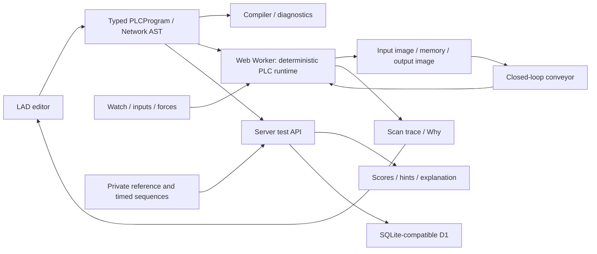

# PLC Lab Web — Architecture and MVP plan

## Runtime data model
`PLCProgram = {version:1,cpu,tags:Tag[],blocks:Block[]}`. Blocks contain ordered networks. `Tag = {name,type,address,initial,comment}`. Shared big-endian I/Q/M byte buffers preserve overlapping bit/byte/word aliases. IEC timer and counter instance states are separate. `runtime.scan(deltaMs)` snapshots physical inputs, executes networks in order, commits outputs and records a trace. Time is virtual and deterministic. End-of-scan output commit is an educational abstraction, not cycle-exact firmware emulation.

## Ladder AST
`Expr = Contact(NO|NC,tag) | Group(AND|OR,children) | Compare(op,left,right) | Timer(TON|TOF|TP,id,PT,input) | Counter(CTU,id,PV,input,reset)`.
`Network = {id,title,logic:Expr,output:Coil|SET|RESET|MOVE|Math}`. Arbitrary nested groups encode real serial/parallel paths; the view never supplies runtime truth.

## Challenge format
Public: `{id,seed,title,level,scenario,objectives,tags,concepts,plant,hints}`. Server-only: `{reference:PLCProgram,suites:TestSuite[]}`. Each generated reference must pass all private tests before publication. Explicit Show Solution retrieves the reference only when requested.

## Test format
`{name,category,steps:[{at:100,inputs:{START:true},expect:{MOTOR:true},reason:'START should energize the motor'}]}`. Each suite starts a fresh runtime. Timed steps run on 10 ms boundaries. Inputs persist between steps. Timers and counters are tested over input histories, not single snapshots.

## Folder structure
`src/plc/{model,memory,runtime,compiler}.ts`, `src/ladder/Editor.tsx`, `src/simulation/{conveyor,worker}.ts`, `src/challenges/{catalog,private,evaluator}.ts`, `src/learning/curriculum.ts`, `src/ui/*`, `app/api/*`, `db/schema.ts`, `tests/*`.

## MVP task list
- Typed AST and tag/address/instance compiler
- Aliased memory; NO/NC, coil, branches, timer/counter runtime
- Mouse LAD editing, monitoring, why trace
- Worker, RUN/STOP/pause/speed/single scan, conveyor feedback
- Tags, watch forces, diagnostics
- 20 parameterized challenge families, reference validation, private sequences
- Progressive hints, solution explanations, scoring
- Persistent projects/attempts and adaptive suggestions
- Runtime regressions, strict TypeScript, production build

## Scope and fidelity
OB1/OB100 execute; CPU hardware-specific limits, preemptive OB30, FB instance interfaces, UDT, PID and FBD/SCL authoring are later phases. This trainer cannot download to physical PLCs. Safety examples never replace safety relays or safety PLCs.

## Primary references
- [Siemens scan cycle](https://docs.tia.siemens.cloud/r/simatic_s7_1200_manual_collection_enus_20/plc-concepts/execution-of-the-user-program/processing-the-scan-cycle-in-run-mode)
- [Siemens CTU](https://docs.tia.siemens.cloud/r/en-us/v21/scl-s7-1200-s7-1500-s7-1200-g2/counter-operations-s7-1200-s7-1500-s7-1200-g2/ctu-count-up-s7-1200-s7-1500-g2)
- [Siemens functional safety manual](https://support.industry.siemens.com/dl/files/552/104547552/att_896075/v1/s71200_f_user_manual_en-US_en-US.pdf)
